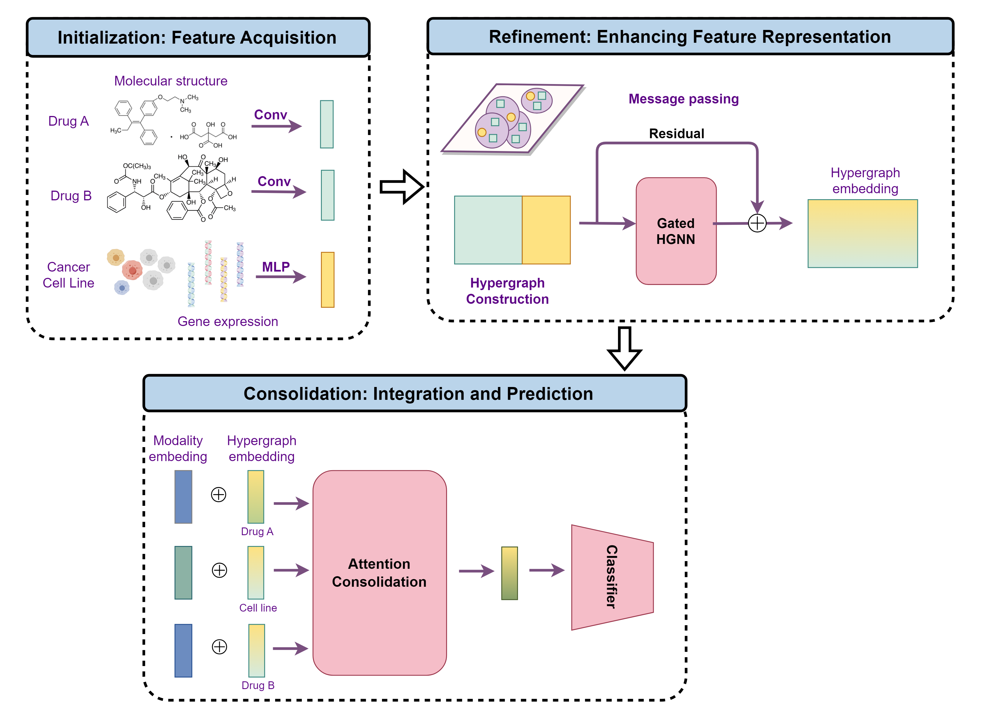

# VQSynergy
In this study, we introduce *VQSynergy*, an innovative machine learning framework that leverages the Vector Quantization (VQ) bottlenecking mechanism, combined with gated residuals and a custom attention mechanism, to improve the data efficiency,accuracy and generalizability of drug synergy prediction models.




# Requirements

refer to Model/requirements.txt
- python==3.8
- deepchem==2.7.1
- numpy==1.24.4
- pandas==2.0.3
- rdkit==2023.3.3
- scikit_learn==1.3.0
- scipy==1.8.1
- torch==1.10.1+cu111
- torch_geometric==2.0.0


# Usage

VQSynergy provides four main scripts for training models on the ALMANAC and O'Neil datasets. Each script is tailored to either quantized or unquantized training:

- **ALMANAC Dataset:**
  - `almanac_quantized.sh`: Trains on the ALMANAC dataset with quantization enabled.
  - `almanac_unquantized.sh`: Trains on the ALMANAC dataset without quantization.

- **O'Neil Dataset:**
  - `oneil_quantized.sh`: Trains on the O'Neil dataset with quantization enabled.
  - `oneil_unquantized.sh`: Trains on the O'Neil dataset without quantization.

To run a script, use the following command:

```bash
bash script_name.sh [GPU] [NOISE]
```

Replace `script_name.sh` with one of the four scripts mentioned above.

- `[GPU]`: (Optional) Specify the GPU ID to use for training. If not provided, the default GPU (0) will be used.
- `[NOISE]`: (Optional) Specify the noise level to apply. If not provided, the default noise level (0) will be used.

