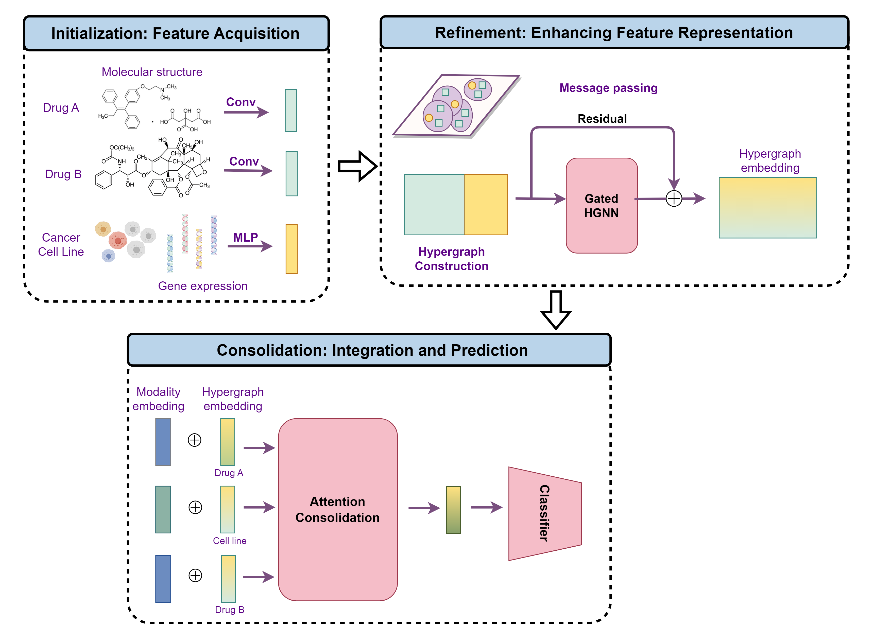

# VQSynergy



## Abstract

The advancement in optimizing cangucer therapies has been significantly boosted by the ability to accurately predict drug synergies. While traditional approaches like clinical trials offer reliability, they are hampered by considerable time and financial requirements. The advent of high-throughput screening and computational breakthroughs has marked a shift towards more efficient methods for investigating drug interactions. In this study, we introduce VQSynergy, an innovative machine learning framework that leverages the Vector Quantization (VQ) mechanism, combined with gated residuals and a custom attention mechanism, to improve the accuracygeneralizability of drug synergy predictions. Our results show that VQSynergy outperforms existing models in robustness, especially in conditions with Gaussian noise, underscoring its superior efficacy and value in the intricate and often unpredictable field of drug synergy research. This study highlights VQSynergy's potential to transform the field through its advanced predictive capabilities, thus contributing to the refinement of cancer treatment strategies.


## Usage

```sh
  cd Model
  python models/main.py
```
